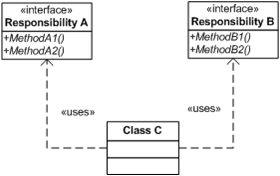
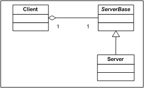
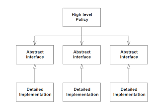

# Clean Code in 5 minutes


Ricardo M. Ferraz Leal

[rhf@ornl.gov](mailto:rhf@ornl.gov?subject=CleanCodeIn5Minutes)

---

# SOFTWARE IS ROTTING WHEN

### Rigidity:
- The system is hard to change because every change forces many other changes to other parts of the system.

### Fragility:
- Changes cause the system to break in places that have no conceptual relationship to the part that was changed.

### Immobility:
- It is hard to disentangle the system into components that can be reused in the other systems.

---

### Viscosity:
- Doing things right is harder than doing things wrong. Needless Complexity – The design contains infrastructure that adds no direct benefit.

### Needless Repetition:
- The design contains repeating structures that could be unified under a single abstraction.

### Opacity:
- It is hard to read and understand. It does not express its intent well

---

# Solid

- **S**ingle responsibility principle
  - **A class should have only a single responsibility**.
- **O**pen/closed principle
  - "Software entities should be open for extension, but closed for modification".
- **L**iskov substitution principle
  - "Subjects in a program should be replaceable with instances of their subtypes without altering the correctness of that program". I.e, derived classes just extend without replacing the functionality of old classes.
- **I**nterface segregation principle
  - No client should be forced to depend on methods it does not use: **use small interfaces** (by splitting large ones...)!
- **D**ependency inversion principle
  - Changes are risky, and by depending on a concept instead of on an implementation, you reduce the need for change at call sites.

---

# Single responsibility principle

Every module or class should have responsibility over a single part of the functionality provided by the software, and that responsibility should be entirely encapsulated by the class.




---

# Open/closed principle

"software entities (classes, modules, functions, etc.) should be open for extension, but closed for modification";
that is, such an entity can allow its behaviour to be extended without modifying its source code




---

# Liskov substitution principle

"Subjects in a program should be replaceable with instances of their subtypes without altering the correctness of that program". I.e, derived classes just extend without replacing the functionality of old classes.

That is, a user of a base class should continue to function properly if a derivative of that base class is passed to it.


---

# Interface segregation principle


The essence of the principle is quite simple. If you have a class that has several clients, rather than loading the class with all the methods that the clients need, create specific interfaces for each client and multiply inherit them into the class.


---

# Dependency inversion principle

Dependency Inversion is the strategy of depending upon interfaces or abstract functions and classes, rather than upon concrete functions and classes. This principle is the enabling force behind component design, COM, CORBA, EJB, etc.

Depending upon Abstractions.

The implication of this principle is quite simple. Every dependency in the design should target an interface, or an abstract class. No dependency should target a concrete class.



---


# Code complexity

> Managing complexity is the most important technical topic in software development.
>
> – Steve McConnell in *Code Complete*.

*Several Studies have found a positive correlation between cyclomatic complexity and defects:*
  - Methods that have the highest complexity tend to also contain the most defects.

Note:
Correlation between LOC and defects has not been proven yet!

---

# Handling Code complexity

> Complexity is reduced by dividing a system into subsystems that are ideally independent.

## Desirable characteristics of Software:

- Simple
- Loosely-Coupled
- Extensible
- Reusable
- Stratified
- Standardized

---

# How do you deal with complexity?

Write **shy code**:
  - Don't reveal yourself to others.
  - Don't interact with too many people.

---

### Abstraction:

- Ignore irrelevant details.

### Encapsulate for easier understanding

- Identify and isolate areas likely to change:
  - Hiding sources of change so its effects are localized: e.g. bad design or construction, or data-size constraints.

### Keep coupling loose:

- Don't use semantic knowledge from other module's inner workings!
-  Law of Demeter (LoD) or principle of least knowledge (next).
- ~~ws.getRun().getGoniometer().getEulerAngles('YZY')~~

Design patterns provide vocabulary for efficient communication, and embody accumulated wisdom over years. **DO NOT overuse them!!!**

---

# Aim for:

- Strong cohesion:
  -  Related code from the same module/class should be bound together as far as possible.
- Low coupling:
  -  All modules should be independent as far as possible
- DbC: use preconditions and postconditions
- Design for test
- Write code for others, not for you!
- Keep design modular.

---

# MetaProgramming

> Put abstractions in code, details in metadata

Example:
If generating files **DO NOT** put tags (e.g. XML) in the code!

For Python, use:
Django template language (DTL), Jinja2, etc...

```python
ws = CropWorkspace({{data.ws_name}}, XMin={{data.xmin}}, XMax={{data.xmax}})
ws = Power({{data.ws_name}}, Exponent={{data.exponent}})

ws_{{loop.index}} = Load({{file}})

```

---

# To start today:

- Limit function size: VT100 size (24x80)?
  - Design by contract (at least Pre conditions!)
- Function intent (Not what it does!)
- Choices made (i.e. why algorithm X and not Y)
- Limit Conditionals
- Limit nested Cycles and nested Conditionals

Use *Code Complexity* tools.

---

#  Replace Conditional statements with polymorphism:

- [Python factories](https://github.com/ricleal/PythonCode/tree/master/src/Design)
- C++:
  - [Non OOP](https://github.com/ricleal/CppTests/blob/master/src/oop/non_oop.cpp)
  - [OOP](https://github.com/ricleal/CppTests/blob/master/src/oop/oop.cpp)

See: [Replace Conditional with Polymorphism](http://www.refactoring.com/catalog/replaceConditionalWithPolymorphism.html)

---

# Python: Stupid simple example

- Regular conditional:

```python
if extension == ".bat":
  doBat()
else if extension == ".sh":
  doSh()
(.....)
```

- Cleaner (?):

```python
doExtensions = {
  ".bat" : doBat,
  ".sh" : doSh
}
doExtensions[extension]()
```

---

## Refactoring: Replace Nested Conditional with Guard Clauses
August
```cAugust
double getPayAmount() {
  double result;
  if (_isDead) result = deadAmount();
  else {
    if (_isSeparated) result = separatedAmount();
    else {
      if (_isRetired) result = retiredAmount();
      else result = normalPayAmount();
    };
  }
  return result;
};  
```

```c
double getPayAmount() {
  if (_isDead) return deadAmount();
  if (_isSeparated) return separatedAmount();
  if (_isRetired) return retiredAmount();
  return normalPayAmount();
};  
```

See : [Replace Nested Conditional with Guard Clauses](http://refactoring.com/catalog/replaceNestedConditionalWithGuardClauses.html)

---

# References

## Books

- [Code Complete: A Practical Handbook of Software Construction, 2nd Edition](http://www.amazon.com/Code-Complete-Practical-Handbook-Construction/dp/0735619670)
- [The Pragmatic Programmer: From Journeyman to Master](http://www.amazon.com/The-Pragmatic-Programmer-Journeyman-Master/dp/020161622X)
- [Clean Code: A Handbook of Agile Software Craftsmanship](http://www.amazon.com/Clean-Code-Handbook-Software-Craftsmanship/dp/0132350882).
- [Working Effectively with Legacy Code](http://www.amazon.com/Working-Effectively-Legacy-Michael-Feathers/dp/0131177052)
- [Refactoring: Improving the Design of Existing Code](http://www.amazon.com/gp/product/0201485672?ie=UTF8&tag=martinfowlerc-20&linkCode=as2&camp=1789&creative=9325&creativeASIN=0201485672)


## Notes:

- [Code Complete Notes](https://github.com/mgp/book-notes/blob/master/code-complete.markdown)
- [S.O.L.I.D: The First 5 Principles of Object Oriented Design](https://scotch.io/bar-talk/s-o-l-i-d-the-first-five-principles-of-object-oriented-design)
- [Inversion of Control Containers and the Dependency Injection pattern](http://martinfowler.com/articles/injection.html)
- [Design Patterns Card](http://www.mcdonaldland.info/files/designpatterns/designpatternscard.pdf)
---

## SOLID

- [Design Principles and Design Patterns](http://www.objectmentor.com/resources/articles/Principles_and_Patterns.pdf)
- [SRP](http://www.objectmentor.com/resources/articles/srp.pdf)
- [OCP](http://www.objectmentor.com/resources/articles/ocp.pdf)
- [LSP](http://www.objectmentor.com/resources/articles/lsp.pdf)
- [ISP](http://www.objectmentor.com/resources/articles/isp.pdf)
- [DIP](http://www.objectmentor.com/resources/articles/dip.pdf)
